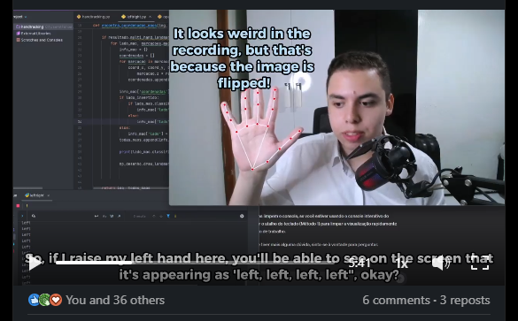

# Controle do PC com as Mãos - Visão Computacional

Este repositório contém um projeto desenvolvido durante o curso da [Alura](https://www.alura.com.br/) utilizando **visão computacional**. O objetivo do projeto é permitir que você controle o computador com movimentos das mãos, mostrando o poder da tecnologia na interação homem-máquina.

---

## Tecnologias Utilizadas

- **Python**
- **OpenCV**
- **MediaPipe**

---

## Objetivo do Projeto

- Explorar conceitos de visão computacional.
- Desenvolver um sistema que reconhece movimentos das mãos e traduz isso em comandos para o computador.
- Entender como bibliotecas como **OpenCV** e **MediaPipe** podem ser usadas para criar soluções interativas e inovadoras.

---

## Demonstração

  

---

## Reflexão Pessoal

Este projeto foi uma oportunidade incrível para mergulhar no mundo da visão computacional e entender como essa tecnologia pode ser aplicada em projetos reais. É um marco no meu aprendizado e uma demonstração do potencial que a programação pode oferecer.

---

📚 *Projeto desenvolvido com entusiasmo e foco no aprendizado durante o curso da Alura.*
